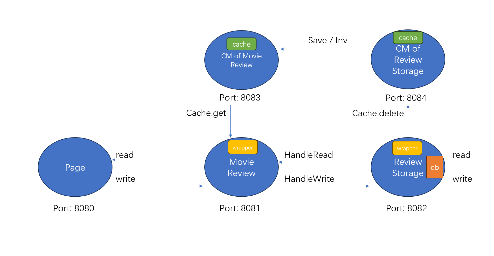
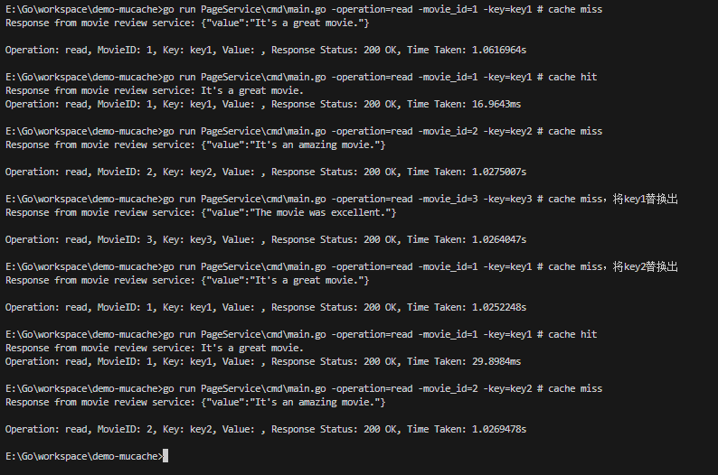
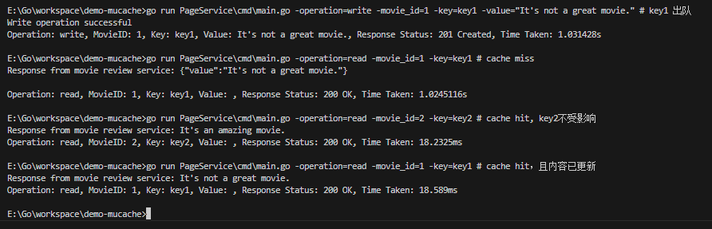

# DemoMucache

#### 介绍

简化版mucache

由于时间关系，做以下简化：

1. 简化了movie review application，删去Plot服务，剩余服务分别运行在不同的线程上，通过http通信。
2. 为了模拟不同服务间调用的时间开销，罚时1000ms。
3. cache大小按照缓存项计算。
4. CM的history和saved两个数据结构的内存不计算在cache里，进而缺少了一种导致cache miss的情况，即history.append()或者saved.store()时cache没有足够空间导致清理缓存项。
5. 由于是特定的服务，省略了wrapper的设计，直接在原有的应用代码里穿插wrapper应当实现的功能。



#### 运行

```bash
# 在不同终端下运行不同服务
# 启动StorageService，cache大小可以在ReviewService\cmd\main.go中修改（比较简陋）默认是2个缓存项
go run StorageService\storage_sevice.go
# 启动ReviewService，cache大小同上
go run ReviewService\cmd\main.go
# PageService命令如下，示例数据可以在 StorageService\cmd\main.go 下找到
go run PageService\cmd\main.go -operation=read -movie_id=<movie_id> -key=<key>
go run PageService\cmd\main.go -operation=write -movie_id=<movie_id> -key=<key> -value=<value>
```

#### 简单的正确性检验

```bash
# 以下命令模拟因容量有限导致的cache miss
go run PageService\cmd\main.go -operation=read -movie_id=1 -key=key1 # cache miss
go run PageService\cmd\main.go -operation=read -movie_id=1 -key=key1 # cache hit
go run PageService\cmd\main.go -operation=read -movie_id=2 -key=key2 # cache miss
go run PageService\cmd\main.go -operation=read -movie_id=3 -key=key3 # cache miss，将key1替换出
go run PageService\cmd\main.go -operation=read -movie_id=1 -key=key1 # cache miss，将key2替换出
go run PageService\cmd\main.go -operation=read -movie_id=1 -key=key1 # cache hit
go run PageService\cmd\main.go -operation=read -movie_id=2 -key=key2 # cache miss
```

运行结果如下，观察可知结果完全符合理论预测。


```bash
# 此时cache中数据如下：列头-key1 key2-列尾
# 以下命令模拟写更新导致的cache miss
go run PageService\cmd\main.go -operation=write -movie_id=1 -key=key1 -value="It's not a great movie." # key1 出队
go run PageService\cmd\main.go -operation=read -movie_id=1 -key=key1 # cache miss
go run PageService\cmd\main.go -operation=read -movie_id=2 -key=key2 # cache hit, key2不受影响
go run PageService\cmd\main.go -operation=read -movie_id=1 -key=key1 # cache hit，且内容已更新
```

运行结果如下，观察可知结果同样符合理论预测。


#### TODO

1. 完成context和wrapper组件
2. 有了1的基础，可以将一个请求包装成一个函数，包含多个读或写的操作。
3. 对cache进行优化，提供更加精细的容量管理和saved history申请接口。
